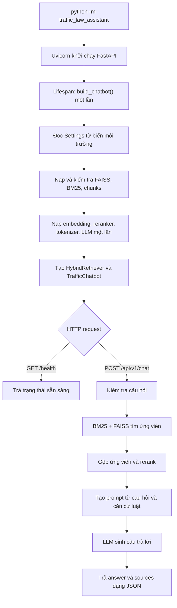

# Traffic Law Assistant

Trợ lý hỏi đáp pháp luật giao thông đường bộ Việt Nam.

## Kiến trúc

- `config.py`: cấu hình ứng dụng từ biến môi trường.
- `knowledge_base.py`: nạp FAISS, BM25 và các đoạn văn bản từ bộ artifact.
- `models.py`: nạp embedding model, reranker, tokenizer và LLM đúng một lần cho mỗi ứng dụng; `ModelLoader` đồng bộ hóa các lời gọi đồng thời.
- `retrieval.py`: tìm kiếm hybrid BM25/FAISS và rerank.
- `service.py`: điều phối truy xuất và sinh câu trả lời.
- `api.py`: HTTP API bằng FastAPI, quản lý vòng đời chatbot và cung cấp health check.

Các model được khởi tạo khi API khởi động, không phải khi nhận từng câu hỏi. Một process ứng dụng giữ và tái sử dụng cùng model bundle. Server mặc định chạy một worker để tránh nạp thêm bản sao model vào bộ nhớ; mỗi worker độc lập sẽ có bộ model riêng.

## Pipeline ứng dụng



### Các bước thực thi

1. `__main__.py` khởi chạy Uvicorn với một worker; FastAPI bắt đầu lifespan.
2. Lifespan gọi `build_chatbot()` một lần. `service.py` đọc cấu hình, nạp knowledge base và kiểm tra số lượng chunk khớp giữa FAISS, BM25 và dữ liệu văn bản; sau đó nạp model bundle.
3. Khi khởi tạo thành công, server nhận request. `GET /health` kiểm tra trạng thái sẵn sàng; `POST /api/v1/chat` nhận câu hỏi.
4. API từ chối câu hỏi trống hoặc dài hơn 4.000 ký tự. Với câu hỏi hợp lệ, `HybridRetriever` lấy ứng viên bằng BM25 và FAISS, gộp ứng viên, rerank và lấy `top_k` đoạn luật.
5. `TrafficChatbot` ghép các đoạn luật vào prompt, dùng LLM đã nạp lúc khởi động để sinh câu trả lời; API trả JSON gồm `answer` và `sources`.

Lỗi cấu hình, thiếu artifact hoặc artifact không khớp sẽ được báo khi khởi động; ứng dụng không chuyển sang chạy với knowledge base thiếu hoặc sai định dạng.

## Chuẩn bị artifact

Đặt ba file đã tạo bởi pipeline RAG vào `data/vector_db/`:

```text
data/vector_db/
├── faiss_bge_m3.index
├── bm25_model.pkl
└── chunk_data.json
```

`chunk_data.json` phải có trường `chunk_texts_with_meta` là danh sách văn bản, cùng thứ tự với các vector trong FAISS và các tài liệu trong BM25. Có thể đặt thư mục artifact khác bằng biến môi trường `TRAFFIC_CHATBOT_ARTIFACT_DIR`.

Các artifact BM25 dạng pickle chỉ nên được nạp từ nguồn đáng tin cậy.

## Chạy

Cài các dependency trong `requirements.txt`, chuẩn bị artifact như hướng dẫn ở trên, sau đó chạy từ thư mục `chatbot-traffic`:

```powershell
python -m pip install -r requirements.txt
python -m traffic_law_assistant
```

API mặc định lắng nghe tại `http://127.0.0.1:8000`. Có thể mở tài liệu Swagger tại `http://127.0.0.1:8000/docs`; health check ở `GET /health`.

Gửi câu hỏi đến `POST /api/v1/chat`:

```json
{
  "question": "Đi xe máy vượt đèn đỏ bị phạt bao nhiêu?"
}
```

Ví dụ response:

```json
{
  "answer": "Mức xử phạt tùy thuộc vào quy định áp dụng và tình tiết cụ thể...",
  "sources": ["Đoạn văn bản pháp luật được truy xuất..."]
}
```

Model mặc định: `BAAI/bge-m3`, `BAAI/bge-reranker-v2-m3` và `Qwen/Qwen2.5-3B-Instruct`. Có thể đổi model và thông số bằng `TRAFFIC_CHATBOT_EMBEDDING_MODEL`, `TRAFFIC_CHATBOT_RERANKER_MODEL`, `TRAFFIC_CHATBOT_LLM_MODEL`, `TRAFFIC_CHATBOT_TOP_K`, `TRAFFIC_CHATBOT_CANDIDATE_K` và `TRAFFIC_CHATBOT_MAX_NEW_TOKENS`.

Chạy kiểm thử API và model loader (không cần tải model):

```powershell
python -m unittest discover -s tests -v
```
